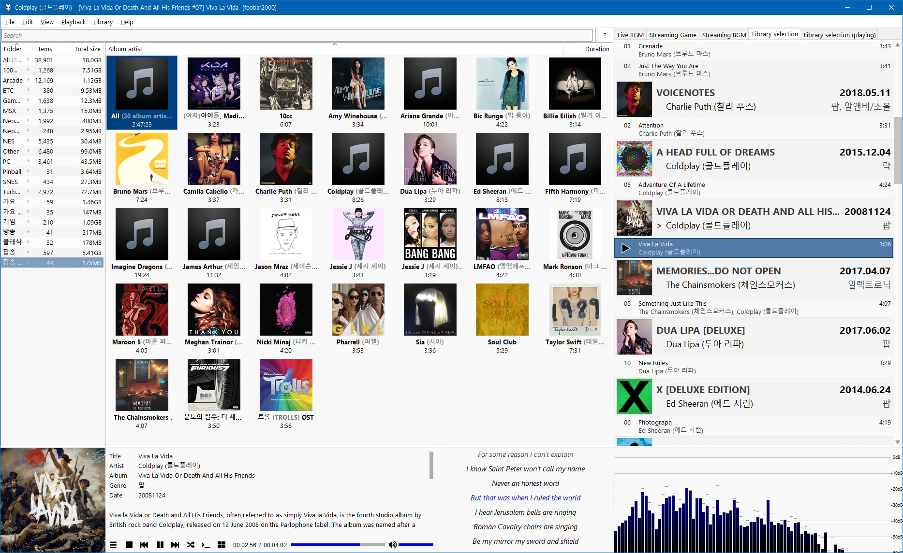

# HybridSpiderMonkey
foobar2000 spider monkey panel script & theme

## Install

### script

1. Install [Spider Monkey Panel](https://github.com/TheQwertiest/foo_spider_monkey_panel/wiki/Installation)
2. Navigate to the [releases](https://github.com/hybridcompiler/HybridSpiderMonkey/releases) page
3. Download the latest release
4. Extract file to foobar2000 folder\user-components\foo_spider_monkey_panel\HybridSpiderMonkey
5. Install foobar2000 folder\user-components\foo_spider_monkey_panel\HybridSpiderMonkey\font\Font Awesome 5 Free-Solid-900.otf
6. Run foobar2000
7. Add spider monkey panel & import samples folder scripts

### theme

1. Install the above script
2. Install [Facets](https://www.foobar2000.org/components/view/foo_facets)
3. Install [jscript Panel](https://marc2k3.github.io/foo_jscript_panel.html)
4. Install [Lyric Show Panel 3](https://www.foobar2000.org/components/view/foo_uie_lyrics3)
5. Run foobar2000
6. Menu -> Preferences -> Display -> Default User Interface -> Import Theme
7. Select foobar2000 folder\user-components\foo_spider_monkey_panel\HybridSpiderMonkey\theme\HybridSpiderMonkey.fth

### Usage

| Key                        | Action                                                  |
| -------------------------- | ------------------------------------------------------- |
| `Mouse` + `Wheel`          | Scrolling text,  Playback time control,  Volume control |
| `Ctrl` +` Mouse` + `Wheel` | Resizing font size                                      |
| `↑` or  `↓`                | Scrolling through one line                              |
| `Page Up` or `Page Down`   | Scrolling through one page                              |
